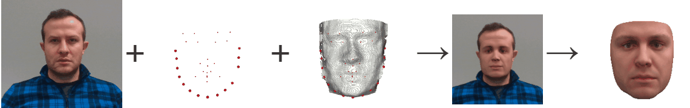

# Efficient 3D Morphable Model Face Fitting Using Depth Sensing Technologies

This is the root directory for the project we've implemented as part of my MSc work. It performs a 3D Morphable Model face fitting and as a result produces a dense 3D face reconstructions based on a single image and the depth information obtained from the camera.

Read the thesis [here](https://github.com/grigala/MScThesis/blob/master/Thesis.pdf).

### Abstract
Human face analysis is an important branch of Computer Vision. One of the interesting topics in this 
area of research is the analysis of a human face based on a single image. The complexity of this problem 
is rather high due to restricted information that is available in a single image. Especially challenging 
is a task of the 3D shape reconstruction of the face based on a single image. The reconstruction process 
has little information to reliably recover the shape information (depth), which is the third dimension that 
is completely missing from an image. Using a single image does not always produce an accurate 3D reconstruction, 
especially in settings where lighting conditions cannot be controlled.

This thesis aims to build an efficient and stable system, which adds, in addition to a photo of a face, 
also a 3D depth information to the reconstruction process. By incorporating a 3D depth information into 
this process, we aim to improve the overall quality of the final shape reconstruction, as well as, the 
visual appearance of the reconstructed face. We build the complete fitting pipeline that consists of 
separate modules dealing with data acquisition, shape reconstruction, and analysis of color and illumination.
 We show that including the complete 3D depth information into the framework in the form of a point 
 cloud indeed improves the final reconstruction quality.

To obtain a 3D depth information alongside the other input requirements, we use an affordable 
consumer depth camera technology offered by [Intel® RealSense™](https://intelrealsense.com) platform. 
The pipeline is flexible enough that it can be seamlessly integrated into the existing demo-framework 
(the [face-fitting web service](https://face-morpher.scalismo.org)) for various use-cases. 
The applications of this work include but not limited to  [Photo-realistic Face Manipulation](https://gravis.dmi.unibas.ch/PMM/demo/face-manipulation/), 
3D face modelling and analysis.

---

Project contains two language specific modules Python server and the Scala client. 
The server handles all the camera related operations, including configuration, data acquisition and delivery for fitting pipeline.

If you do not have a dedicated camera, [FitScriptOffline.scala](scala/src/main/scala/ch/unibas/cs/gravis/thriftservice/apps/FitScriptOffline.scala) is your starting point. 

Otherwise, first you should run [Server.py](python/Server.py) and then [FitScriptOnline.scala](scala/src/main/scala/ch/unibas/cs/gravis/thriftservice/apps/FitScriptOnline.scala)

> Note: You cannot run the code without having Basel Face Model (BFM) in `/data` directory inside the Scala project root. You can obtain a copy of BFM from [this](http://gravis.dmi.unibas.ch/PMM/data/overview/) website. You then have to augment the model with an additional chin landmarks which are stored in [landmarks.txt](/scala/data/landmarks.txt) file, using the script [AugmentModel.scala](scala/src/main/scala/ch/unibas/cs/gravis/thriftservice/scripts/AugmentModel.scala). 

DEMO:

## Technology Stack & Credits

This work would not have been possible without the following Open Source projects:
### Server-side:

* [Python 3](https://www.python.org)
* [OpenCV (Python)](https://opencv.org)
* [librealsense (Python Wrapper)](https://github.com/IntelRealSense/librealsense)
* [dlib (Python)](http://dlib.net)
* [Apache Thrift](https://github.com/apache/thrift)
* [Numpy](https://github.com/numpy/numpy)

### Client-side:

* JDK 1.8
* [Scala](https://github.com/scala/scala)
* [SBT](https://github.com/sbt/sbt)
* [Finagle](https://github.com/twitter/finagle)
* [Scrooge](https://github.com/twitter/scrooge)
* [Scalismo](https://github.com/unibas-gravis/scalismo)
* [Scalismo-faces](https://github.com/unibas-gravis/scalismo-faces)
* [Scalismo-ui](https://github.com/unibas-gravis/scalismo-ui)
* [Scalismo Tutorials](https://scalismo.org/tutorials)
* [Probabilistic Fitting](http://gravis.dmi.unibas.ch/PMM/lectures/fitting)

## Copyright and License

The code is distributed under GNU General Public License v3.0, refer to [LICENSE](LICENSE) for more details.

© Giorgi Grigalashvili as part of my MSc Thesis at University of Basel, Graphics and Vision Research Group, 2019.

## References

Refer to the last pages of the  [thesis](https://github.com/grigala/MScThesis/blob/master/Thesis.pdf).
